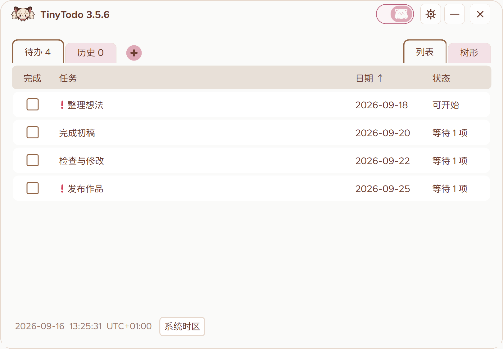
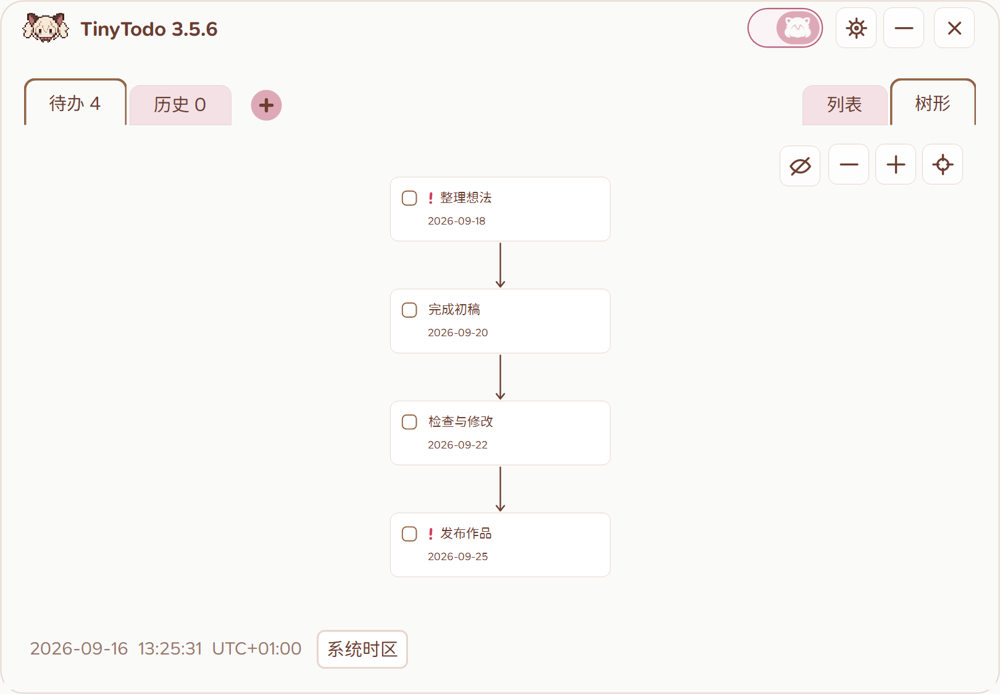

# TinyTodo

[下载安装包](https://github.com/zhuzihan728/TinyTodo/releases/latest)

任务列表、重要标记、截止日期与完成历史。

树状依赖关系、任务预览与 Markdown 描述。

猫猫开关与透明动态悬浮入口，记住窗口位置，支持全屏隐藏和程序黑名单。

> Disclaimer：本项目全部使用 GPT 制作，图片也由 GPT 生成。
