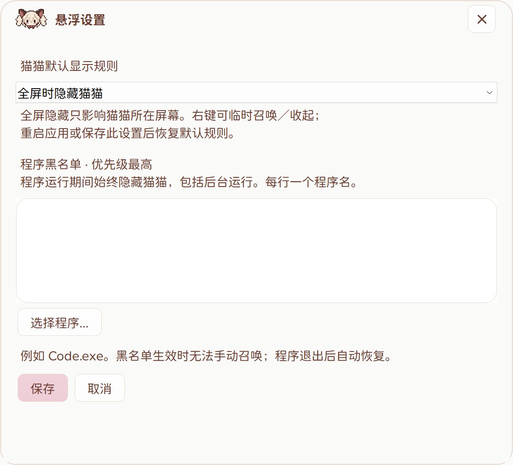

# 构建

Windows 10/11，.NET Framework 4.x。

- `build.cmd`：编译到 `bin/TinyTodo.exe`。
- `test.cmd`：业务测试。
- `ui-test.cmd`：界面测试；先退出 TinyTodo，测试使用临时数据。
- `powershell -ExecutionPolicy Bypass -File packaging/build-package.ps1 -Compiler "C:\Path\To\ISCC.exe"`：生成安装包与便携 ZIP。

安装包使用 [Inno Setup 6.7+](https://jrsoftware.org/isdl.php)。仓库不包含编译器；本地便携编译器可放在 `tools/InnoSetup`。

## 目录

- `src` / `tests`：源码与测试。
- `assets`：运行资源；`assets/source` 保留用户提供的原始素材。
- `packaging`：安装脚本和中文安装说明。
- `docs/screenshots`：演示数据截图。
- `dist`：本地生成的安装包和便携包，通过 GitHub Releases 分发。
- `artifacts` / `archive`：本地测试产物和历史归档，不提交。

安装器默认勾选开机自启动和桌面快捷方式，可取消。仅安装到当前用户目录，交互卸载默认勾选清理任务文件与备份，可取消保留数据。静默卸载默认保留数据；仅显式传入 `/PURGETASKDATA=1` 时清理。

字体许可证与来源见 `assets/Font-license.txt` 和 `assets/Font-source-notice.txt`。安装器中文翻译取自 [Inno Setup 翻译文件](https://github.com/jrsoftware/issrc/blob/main/Files/Languages/ChineseSimplified.isl)，保留文件内署名。

## 发布验证

2026-09-16：73 项业务测试、337 项 UI 检查通过（225% 缩放）；安装、取消卸载、默认勾选清理任务与静默卸载检查通过。`tools/TestInstaller.ps1` 在工作区临时目录验证安装包，不清理个人任务。

## 3.5.3 悬停修复

鼠标停留于原任务或 Markdown 预览卡片时保持预览；离开两者后短暂延迟关闭，原任务与卡片间切换不重建窗口。列表和树节点均使用实际命中范围；切换到其他应用仍关闭预览。升级请直接覆盖安装，安装器不写入任务数据目录。

验证：73 项业务测试、345 项 UI 检查通过；隔离执行 3.5.2 → 3.5.3 覆盖安装，默认自启动/桌面快捷方式与版本升级正常，已登记任务文件的 SHA256 前后一致，原安装登记未改变。可运行 `tools/TestUpgrade.ps1` 复现（需要旧版和新版发布目录及 Inno Setup）。

## 3.5.4 菜单图标

任务右键菜单的“设为／取消”复用任务预览按钮的红色叹号图标，紧跟文字、垂直居中，并忽略空快捷键栏的绘制请求。73 项业务测试、347 项 UI 检查通过；已隔离验证 3.5.3 → 3.5.4 覆盖升级，已登记任务文件哈希不变。

## 3.5.5 悬浮设置与窗口位置

设置 → 悬浮设置提供“默认隐藏猫猫 / 全屏时隐藏猫猫 / 默认开启猫猫”，默认选择同屏全屏隐藏。旧任务文件自动使用此默认值，任务结构和数据目录不变。

- 普通程序不再因系统通知“忙碌”状态隐藏猫猫。只比较前台全屏窗口与猫猫所在屏幕；普通最大化窗口不会误判。猫猫保留不激活窗口的置顶属性，主窗口和对话框遵循普通窗口层级。
- 主窗口每次重开保留上次位置，拖动猫猫不会改变主窗口位置。猫猫开关只控制猫猫显隐，任务表始终可从托盘打开。
- 托盘、猫猫右键和标题栏使用“收起猫猫 / 召唤猫猫”。手动选择持续到重启或保存悬浮设置；黑名单优先级更高。
- 黑名单每行一个程序名，也可选择 EXE。匹配程序名，不区分大小写；后台运行也生效。仅配置黑名单时在后台线程约每秒检测一次。黑名单生效时禁用召唤，保留其他托盘菜单功能；程序退出后自动恢复。

验证：93 项业务检查、379 项 UI 检查通过（225% 缩放），包含旧版悬停、托盘与输入隔离回归；新增位置保留、规则持久化、后台进程黑名单及退出恢复、无焦点置顶修复。多屏验证包含不同分辨率、负坐标的屏幕边界以及真实 Win32 无边框全屏窗口；未直接运行英雄联盟或 WoW。

Windows 行为参考：[SetWindowPos 的不激活选项](https://learn.microsoft.com/en-us/windows/win32/api/winuser/nf-winuser-setwindowpos)、[DWM 可见窗口边界](https://learn.microsoft.com/en-us/windows/win32/api/dwmapi/ne-dwmapi-dwmwindowattribute)。UI 测试会先点击其自身已验证的测试窗口，取得测试所需的前台权限；生产程序没有模拟输入、全局快捷键或键盘钩子。

最终安装包已隔离验证 3.5.4 → 3.5.5 覆盖升级；默认自启动与桌面快捷方式正常，已登记的 4 个数据文件 SHA256 完全一致，用户原安装登记未改动。
